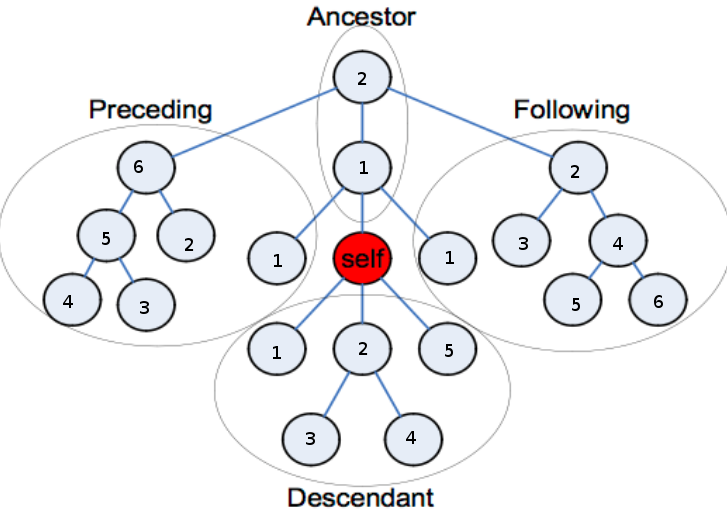

# IT konspektas

## XML

### Žymių sąvokos

```xml
<autorius>Jonas Jonaitis</autorius>
<knyga kalba="lt">
```

* Duomuo - *Jonas Jonaitis*, *lt*
* Duomens aprašas - *autorius*, *knyga*
* Skirtukai - *<*, *>*, *=*


### Reikalavimai

* žymių ir atributų pavadinimai - be tarpų
* žymėje negali būti atributų su tais pačiais pavadinimais (gali skirtis vardų sritys)
* tik viena šakninė žymė
* žymės padavinimas turi prasideti raide, _ arba :
* žymės padavinime galima naudoti raides, skaičius, . , - , _ ir :


### Vardų sritys

```xml
<book xmlns:bk="http://loc.gov/books">
  <bk:title bk:language="en">Introduction to XML</bk:title>
</book>
```

* *bk* - prefiksas (sutrumpintas vardas)
* *http://loc.gov/books*  - vardų strities vardas
* *http://loc.gov/books:title*, *http://loc.gov/books:language* - kvalifikuoti (tikri) vardai
* *book* neturi vardų strities

Vardų sritis galioja tik žymės viduje ir vaikuose  (galioja ir vardų sričiai pagal nutylėjimą (*xmlns=*) )
Atributams vardų sritis pagal nutylėjimą negalioja.

Atributų unikalumas

```xml
<x xmlns:n1="http://www.w3.org" xmlns:n2="http://www.w3.org" xmlns:n3="http://www.vu.lt" xmlns="http://www.vu.lt">
    <blogai a="1" a="2"/>
    <blogai n1:a="1" n2:a="2"/>
    <gerai a="1" b="2"/>
    <gerai a="1" n3:a="2"/>
</x>
```

## XPath


* ```/``` šakininis mazgas
* ```/*``` šakninė žymė

### Ašys

* ancestor(-or-self) [eina atgal]
* descendant(-or-self)
* preceding(-sibling) [eina atgal]
* following(-sibling)
* self
* parent
* child
* attribute

### Ašių sutrumpinimai

* ``child`` yra pagal nutylėjimą, t.y.:
  * ``knyga`` == ``child::knyga``
  * ```*``` == ``child::*``
* ``@`` == attribute
* ``//`` == ``/descendant-or-self::node()/``
* ``.`` ==  ``self::node()``
* ``..`` == ``parent::node()``

</td>
<td>



### Predikatai

* skaičius [2] verčiamas į [position()=2]
* mazgų aibė [./@pavadinimas] - verčiamas į boolean, t.y. ar ne tuščia
* string - ["a"] verčiamas į boolean ar ne "".


#### Žymių numeracija

* prasideda nuo 1
* eina gylyn (vaikai prieš brolius )

* //knyga[1] - gražina visas pirmas knygas
* (//knyga)[1]  -gražina pirmą knygą


### Išraiškos

#### Operacijų prioritetai

1. Skliausteliai: ( ir )
2. Žingsnių skirtukas: / (tai ne dalyba!)
3. Aibių sąjungos operatorius: | (dirba tik su aibėmis)
4. Daugyba/dalyba: *, div (slankiu kableliu), mod (liekana)
5. Sudėtis/atimtis: +, - (dirba tik su skaičiais)
6. Mažiau/daugiau: <, <=, >, >= (dirba tik su skaičiais)
7. Lygu/nelygu: =, != (su aibėmis nedirba)
8. Loginis "ir": and
9. Loginis "arba": or

* Neigimas - not()
* Konstantos - true(), false()
* last() - mazgų aibės dydis
* position() - mazgo pozicija
* count() - s
* sum() - verčia mazgus į string, tada į number ir tada sudeda

#### string()

* aibė
  * tuščia == ""
  * kt. - imamas pirmas aibės elementas, ir jei jis
    * žymė - imami įpedinių tekstiniai laukai ir sujungiami į eilutę
    * atributas - imama reikšmė
    * tekstas - imama reikšmė
* skaičius
  * NaN = "NaN"
  * +∞ = "Infinity"
  * -∞ = "-Infinity"
  * skaičius - reikšmė
* boolean
  * true ="true"
  * false = "false"

praleistas argumentas <-> self::node()

#### number()

* string - skaičius arba NaN
* boolean - true = 1, false = 0
* aibė - string() ir tada į skaičių

praleistas argumentas <-> self::node()

#### boolean()

* aibė - tuščia == false
* skaičius - "0" ir "NaN" == false
* string - "" == false

#### <, <=, >, >=

* jei ne aibės - verčiamos į skaičius *number()*
* jei aibės
  * aibė ir aibė - abiejų aibių elementams - *number()*, *dekarto sandauga* ir jei bent vienas tenkina - true;
  * aibė ir skaičius - aibės elementams - *number()*, *dekarto sandauga* su skaičium ir jei bent vienas tenkina - true;
  * aibė ir string - aibės elementams ir string - *number()*, *dekarto sandauga* ir jei bent vienas tenkina true;
  * aibė ir boolean - aibė verčiama į *boolean()* (t.y. ar ne tuščia), tada abiems - *number()*;

#### !=, =

* jei ne aibės
  * jei bent vienas boolean - abu *boolean()*
  * kitaip, jei bent vienas skaičius - abu *number()*
  * kitaip abu į string()
* jei aibės
* aibė ir aibė - abiejų aibių elementams - *string()*, *dekarto sandauga* ir jei bent vienas tenkina - true;
  * aibė ir skaičius - aibės elementams - *number()*, *dekarto sandauga* su skaičium ir jei bent vienas tenkina - true;
  * aibė ir string - aibės elementams ir string - *string()*, *dekarto sandauga* ir jei bent vienas tenkina true;
  * aibė ir boolean - aibė verčiama į *boolean()* (t.y. ar ne tuščia);

#### naudinga

 border="1"><tr><td>

@id unikalumas - ```//*[@id = following::*/@id or @id=descendant::*/@id]```

mažiausios kainos knyga - ```//knyga[not(kaina > //knyga/kaina)]```

### XML schema

Žymės deklaracija -
 minOccurs, maxOccurs, default, fixed

Atributu deklaracija -
 default, fixed, use[optional, prohibited, required]

```xml
<all
maxOccurs = 1 : 1
minOccurs = (0 | 1) : 1>
Content: (annotation?, element*)
</all>
```

</td></tr><tr><td>

```xml
<choice
maxOccurs = (nonNegativeInteger | unbounded) : 1
minOccurs = nonNegativeInteger : 1>
Content: (annotation?, (element|choice|sequence)*)
</choice>
```

```xml
<sequence
maxOccurs = (nonNegativeInteger | unbounded) : 1
minOccurs = nonNegativeInteger : 1>
Content: (annotation?, (element|choice|sequence)*)
</sequence>>
```

#### Turinio tipai

||Mišrus|Sudėtingas|Paprastas|Tuščias|
|---|---|---|---|---|
|Turinio rūšys|complexContent mixed=true|complexContent|simpleContent|complexContent, simpleContent|
|Gali turėti vaikinių žymių|Taip|Taip|Ne|Ne|
|Gali turėti tekstą|Taip|Ne|Taip|Ne|

#### Simple type

``xs:string``
galima naudoti abribojimus: ``length``, ``minLength``, ``maxLength``, ``pattern``, ``enumeration``

``xs:date``, ``xs:integer``
galima naudoti abribojimus: ``pattern``, ``enumeration``, ``minInclusive``, ``minExclusive``, ``maxInclusive``, ``maxExclusive``, ``totalDigits`` (sk. kiekis), ```fractionDigits``` (sk. po kablelio)

Paprastas tipas išvedamas:

* apribojimu iš *complexType ((simpleContent) arba (complexContent ir minOccurs=0))* - galima apriboti žymės/atributo tipą, uždrausti atributo naudojimą
* išplėtimu iš *(simpleType arba complexType) simpleContent* - galima pridėt tik atributus

Išplečiant *complexType* žymės pridedamos tik į galą


</td></tr><tr><td>

Tuščias turinys turi tik atributus.

```xml
<xs:element name="book">
    <xs:complexType>
        <xs:attribute name="isbn" type="isbnType"/>
    </xs:complexType>
</xs:element>
```

Apribojimo principas - ribojimas tipas turi atitikti ir tėvinių tipų taisykles.  
Dviprasmiško turinio taisyklė - neturi būti kelių vienai prasidenančių žymių (sequence) choise struktūroj.
Neprieštaringo deklaravimo taisyklė - negali būti vienodai pavadintų, bet skirtingų tipų žymių vienoj strukturoj.

#### Unikalumas

```xml
<xs:element name="knygųSąrašas" type="...">
    <xs:unique name="KnygųRibojimas">
        <xs:selector xpath="grupė/knyga"/>
        <xs:field xpath="autorius/vardas"/>
        <xs:field xpath="autorius/pavardė"/>
    </xs:unique>
</xs:element>
```

``unique`` reikšmės nerivalomos, ``key`` - privalomos  
``keyref`` turi būti paskeltas tame pačiame lygyje arba aukščiau nei ``key``/``unique``
``xpath`` gali eit tik gilyn, ir jei naudojama vardų stritis reikia naudoti prefiksus prie kievieno žingsnio ``xpath=p:grupė/p:knyga``


 border="1"><tr><td>

#### Schemos susiejimas

be vardų srities

```xml
<?xml version="1.0" encoding="UTF-8"?>
<užsakymas data="2006-02-28"
    xmlns:xsi="http://www.w3.org/2001/XMLSchema-instance"
    xsi:noNamespaceSchemaLocation="uzsakymas.xsd">
</užsakymas>
```

su vardų sritim

```xml
<?xml version="1.0" encoding="UTF-8"?>
<užsakymas
    xmlns="http://uzsakymai.lt"
    xsi:schemaLocation="http://uzsakymai.lt uzsakymas.xsd"
    xmlns:xsi ="http://www.w3.org/2001/XMLSchema-instance">
    <prekiųSąrašas>...</prekiųSąrašas>
</užsakymas>
```

#### elementFormDefault

unqualified -  lokalioms žymėms negalioja globalus xmlns:, galioja pagal tėvinį type

```xml
<x:author xmlns:x="http://example.org/publishing">
   <name>Aaron Skonnard</name>
   <phone>(801)390-4552</phone>
</x:author>
```

qualified - lokalioms žymems galioja globalus xmlns.

```xml
<x:author xmlns:x="http://example.org/publishing">
   <x:name>Aaron Skonnard</name>
   <x:phone>(801)390-4552</phone>
</x:author>
```

Abu galioja dokumentams, ne schemai.

## JSON

### Duomenų tipai:

* skaičius - su kableliu arba be, galima eksponentinė išraiška(```1.0E+2```) negali būti nurodytas ```NaN```
* eilutė (string) - išskiriama "", escape simbolis - \
* boolean - ```true``` arba ```false```
* masyvas - ```[x,y,z]``` nebutinai vienodo tipo duomenys
* ```null```
* objektas ```{"x":y, "z":w}```, nesvarbi raktų tvarka ir unikalumas

## JSON schema

tie patys tipai + ```integer```

galima nurodyti kelis tipus ```"pavadinimas": { "type": ["number", "string"] }```

### String

* minLength,maxLength
* pattern (regex)
* format (date-time, email, hostname, ipv4, ipv6, uri)

### integer, number

* multipleOf (kartotinis)
* minimum, maximum, exclusiveMinimum, exclusiveMaximum

### object
* properties ({raktas - reikšmė (tipas)})
* additionalProperties (boolean) 
* required ({sąrašas raktų})
* minProperties, maxProperties (skaičius)

### array

* items ({ elementų ribojima pvz.: "type":})
* additionalItems (Ar leidžiami papildomi neaprašyti elementai)
* minItems, maxItems (skaičius)
* uniqueItems (boolean)

### enum

### perpanaudojimas

definitions ir ref

```json
{
  "$schema": "http://json-schema.org/draft-04/schema#",
  "definitions": {
    "adresas": {
      "type": "object",
      "properties": {
        "gatvė":    { "type": "string" },
        "miestas":  { "type": "string" },
        "šalis":    { "type": "string" }
      },
      "required": ["gatvė", "miestas", "šalis"]
    }
  },
  "type": "object",
  "properties": {
    "sąskaitos_adresas": { "$ref": "#/definitions/adresas" },
    "pristatymo_adresas": { "$ref": "#/definitions/adresas" }
  }
}
```

### praplėtimas

* allOf
* anyOf
* oneOf

```json
"pristatymo_adresas": {
  "allOf": [
    // įtraukiam bazinį adresą
    { "$ref": "#/definitions/adresas" },
    // ..ir praplečiam jį pristatymo adreso specifika
    { "properties": {
        "tipas": { "enum": [ "namų", "darbo" ] }
      },
      "required": ["tipas"]
    }
  ]
}
```

``schema`` nurodo kad schema ir schemos versija (rekomentuojama)  
``id`` nurodo unikalų identifikatorių ir bazinį kelią kurio ieškos ``$ref`` (rekomenduoja url, su failu, ref ieškos tame pačiame katologe)

## HTML

```html
<!DOCTYPE html>
<html lang="lt">
<head>
    <meta charset="UTF-8">
    <title>Pirmas puslapis</title>
</head>
<body>
    HTML5 pavyzdys
</body>
</html>
```

* doctype - html versija, nusprendžiama apdorojimo režimas (90+)
* html - šakninis elementas, vaikai head ir body, atributas lang - rekomendacija lokalizacijai
* head - metaduomenys, vartotojui nematomi
* body - turinys, kuris atvaizduojamas 

### head

``title`` beveik visuomet privalomas (išskyrus iframe?)  
``charset`` rekomenduojamas

### kitos žymes

* ``<h1>Skyrius<h1>``
* ``<p>Paragrafas<p>``
* ``<em>Pabrėžiamas, pasviręs <em>``
* ````
* ``<a href="puslapis.html">Nuoroda</a>`` (viduje gali būti kitos žymes, veiks ant jų paspaudus)
* ``<ul> <li>Unordered</li><li>list</li><li>Nenumeruotas sąrašas</li> </ul>``
* ``<ol> <li>Ordered</li><li>list</li><li>Numeruotas sąrašas</li> </ol>``
* ``<br>`` line break

<table border="1">
    <tr>
        <th rowspan="2">Table</th>
        <th colspan="3">Header</th>
    </tr>
    <tr>
        <th>table</th>
        <th>header</th>
        <th>th/th>
    </tr>
    <tr>
        <td>table</td>
        <td>data</td>
        <td>td</td>
        <td>td</td>
    </tr>
</table>

```html
 border="1">
    <tr>
        <th rowspan="2">Table</th>
        <th colspan="3">Header</th>
    </tr>
    <tr>
        <th>table</th>
        <th>header</th>
        <th>th/th>
    </tr>
    <tr>
        <td>table</td>
        <td>data</td>
        <td>td</td>
        <td>td</td>
    </tr>
</table>
```

 border="1"><tr><td>

```xml
<form name="forma" action="rezultatas.html" method="post">
```
input tipai - ``button``, ``text``, ``password``, ``checkbox``, ``submit``, ``radio``, ``reset``  
html5 input tipai - ``tel``, ``search``, ``url``, ``email``, ``datetime``, ``date``, ``month``, ``week``, ``time``, ``datetime-local``, ``number``, ``range``, ``color``  
html5 input atributai - ``placeholder``, ``autofocus``, ``required``

```html
<select multiple size="4" name="manoMeniu">
    <option selected value="r">Raudona</option>
    <option selected value="g">Geltona</option>
    <option value="z">Žalia</option>
    <option value="m">Mėlyna</option>
</option>
```

multiple - galima pažymėt kelis
size - kiek eilučiu (jei daugiau - slankjuostė) (size=1 && !multiple <-> dropdown)

```html
<textarea name="tekstas" rows="5" cols="30">tekstas<textarea>
```

cols-eilutės ilgis

### special characters

* ``&nbsp;`` non-breaking space
* ``&lt;`` less-than <
* ``&gt;`` greater-than >
* ``&amp;`` ampersand

### semantiniai elementai

* ``section`` -
Elementas nurodantis tam tikrą dokumento dalį/skyrių. 
Skirtas tematiniam turinio grupavimui.
Dažniausiai turi antraštę.
Tinklapis gali būti padalintas į kelias sekcijas: naujienos, kontaktai ir t.t.  
* ``nav`` -
Elementas nurodantis dokumento dalį, kuri turi nuorodas į kitus dokumentus ar to paties dokumento dalis.
Visų dokumento nuorodų į nav dėti nereikia, tai turėtų būti tik pagrindiniai navigaciniai blokai. Pvz. puslapio apačioje esančiom nuorodoms pakanka footer elemento.
* ``article`` - 
Elementas talpinantis tam tikrą informaciją, kuri gali būti platinama nepriklausomai nuo kitos informacijos.
Pvz: forumo pranešimas, blogo įrašas, vartotojo komentaras.
* ``aside`` -
Nurodo puslapio dalį, kuri susideda iš turinio, kuris nėra tiesiogiai susijęs su turiniu esančiu apie jį.
Galima naudoti reklaminiam blokam, citatoms ir pan.
* ``hgroup`` -
Nurodo dokumento dalies antraštę.
Naudojamas grupuoti h1-h6 elementus, kai antraštė yra kelių lygių.
* ``header`` -
Nurodo įžanginių ar navigacinių elementų grupę. Dažniausiai viduje turi h1-h6 arba hgroup elementus.
* ``footer`` -
Nurodo dokumento artimiausio protėvio sekcijos poraštę. Dažniausiai nurodoma informacija apie tą sekciją: kas ją parašė, autorių teisės, data ir pan.
* ``time`` -
Nurodo laiką 24 valandų formate arba tikslią datą. Papildomai gali būti nurodyta ir laiko zona.
* ``mark`` -
Nurodo teksto dalį pažymėtą ar paryškintą dokumente. Pvz.: paieškos rezultatuose raktažodį, pagal kurį ieškota.

## CSS

### Css ir html susiejimas

```html
    <style type="text/css">
        h1, h2 {..css..}
    </style>
```

```html
<link rel="stylesheet" href="stilius.css" type="text/css">
```

```html
    <style type="text/css">
        @import url("css/stilius1.css"); <!-- atsiunčia visada -->
        @import url("css/stilius2.css") print  <!-- atsiunčia tik jei spausdinama -->
    </style>
    <style type="text/css" media="print">  <!-- atsiunčia tik jei spausdinama -->
        @import url("css/stilius3.css");
        @import url("css/stilius4.css")
    </style>
```

media tipai: ``screen``, ``print``, ``projector``, ``tv``, ``all``(default)

### Media Queries Level 3

```css
@media screen and (max-width: 420 px) { ... }

@media only screen and (orientation: portrait) { ... }
```

```html
<link href="desktop.css" rel="stylesheet" 
  media="screen and (min-device-width: 480px)">
```

### selectoriai

* ``*`` - bet kuri žymė, gali būti praleistas
* ``h1`` - žymė
* ``h1 em`` - įpedinis
* ``h1 > em`` - vaikas
* ``[att]``, ``[att="val"]``, ``h[att]``  - atributo; ``[att~="val"]`` - vienas iš atribute esančių žodžių(atskirtų tarpais) yra "val"
* ``.val``, ``h[class="val"]``, ``p.val`` - klasės; ``.val1.val2`` - tik jei turi abi klases
* ``#a15``, ``[id="a15"]``, ``div#15`` - id selectorius
* ``:link``(neaplankytom nurodom), ``:visited``(aplankytom nuorodom), ``a:active`` (spaudimo ant nuorodos momentu), ``:focus:hover`` (dabar redaguojamo lauko, užvedus pele) ``:first-line``, ``:first-letter`` -pseudo klasės

grupuojama (or) kableliais ty. ``h1, h2, h3 { ..css }``

### paveldejimas

``color``, ``font-family``, ``font-size``, ``text-align``, ``visibility`` - paveldima
``background-color``, ``background-image``, ``margin``, ``padding`` - nepaveldima

``inherit`` paveldima tėvo (ne protėvio) reikšmė

### Kaskadų mechanizmas

1. naršyklės stiliai {mažiausias prioritetas}
2. vartotojo stiliai
3. autoriaus (tinklalapio) stiliai
4. autoriaus (tinklalapio) svarbūs(``!important``) stiliai
5. vartotojo svarbūs stiliai(``!important``) {didžiausias prioritetas}

### specifiškumas
a \*1000 + b\*100 + c\*100 + d.

* a = jei CSS taisyklė paskelbta HTML žymės atribute style (o ne stilių lentelėje), tai a=1, priešingu atveju a=0. Jeigu a=1, tai visos kitos reikšmės (b, c, d) lygios 0
* b = {ID selektorių skaičius}
* c = {atributų/klasių selektorių ir pseudo-klasių skaičius}
* d = {žymių selektorių ir pseudo-elementų skaičius}

| * | a=0 | b=0 | c=0 | d=0 |
| --- | --- | --- | --- | --- |
| li | a=0 | b=0 | c=0 | d=1 |
| li:first-line | a=0 | b=0 | c=0 | d=2 |
| ul li | a=0 | b=0 | c=0 | d=2 |
| body ol > li |	a=0 |	b=0 |	c=0 |	d=3 |
| ol > [att=up] | a=0 | b=0 | c=1 |d=1 |
| div ol li.red | a=0 |b=0 | c=1 | d=3 |
| li#x34 | a=0 | b=1 | c=0 | d=1 |
| style="color:red" | a=1 | b=0 | c=0 | d=0 |

vienodo specifiškumo atveju imama paskutinė taisyklė

visibility: hidden - paverčiama nematoma (bet vieta visvien užimamama)
display: none - nerenderinama
display: block - sukuriamas atskiras stačiakampis kuriame rodoma
display: inline - vaizduojama einamojo bloko eilutėj

## Javascript

Case sensitive, ty. null !== NULL
Masyvai yra objektai
Sveikas skaičius neskiriamas realus skaičius
Masyvai gali turėt bet kokius objektus, galima praleisti
Funkcijos argumentai saugomi arguments[]
ParseInt parsina skaičiu nuo pradžios, galima nurodyt bazę

### Konversija

Sudėties operatorius, jei bent vienas operandas nėra skaičius, operandus verčia į string
Kiti verčia operatoriai į skaičius

### Kintamieji

#### be ``var``

```javascript
x;
y = x+1; // klaida
```

gali būti tik globalūs

#### su ``var``

```javascript
    var x;
    y = x+1; // NaN (arba undefined jei ne skaitinis kontekstas)
```

gali būti globalūs ir lokalūs

``undefined`` ir ``null`` loginėse išraiškose virsta ``false``
``null`` virsta nuliu skaitinėse išraiškose

### Naudinga
Datos validacija

```javascript
function checkDate(yearStr, monthStr, dayStr)
    if (yearStr != parseInt(yearStr)) {
        return false;
    }
    year = parseInt(yearStr);
    month = parseInt(monthStr)-1; // Sausis - 0
    day = parseInt(dayStr);
    if (month < 0 || month > 11) {
        ...
    }
    var date = new Date(year, month, day);
    if (date.getDate() != day) {
        return false;
    }
}
```

### Native js

```javascript
document.getElementById();
document.getElementsByTagName()
window.document.childNodes[0].childNodes[1].childNodes[4]
```

Jei turime pTag, galime eiti į:
* sekantį brolį: ``pTag.nextSibling``
* prieš tai einantį brolį: ``pTag.previousSibling``
* tėvą: ``pTag.parentNode``
* vaikus: ``pTag.childNodes``
* atributus: ``pTag.attributes``
* atributo vardas: ``pTag.attributes[0].nodeName`` (``alert(pTag.getAttribute("title"))``)
* atributo reikšmė: ``pTag.attributes[0].nodeValue``
* ieškoti žemiau medyje esančių mazgų pagal žymės vardą: ``pTag.getElementsByTagName("b")``

```javascript
pTag.setAttribute("class", "paragrafas");
pTag.removeAttribute("class");
pTag.firstChild.nodeValue = "Naujas tekstas";
var newParagraph = document.createElement("p");
var paragraphText = document.createTextNode("Naujas txt");
newParagraph.appendChild(paragraphText);
bodyTag.removeChild(newParagraph)
newParagraph.onclick = function () {
   this.parentNode.removeChild(this);
};
```

### jQuery 

jQuery() $()

```javascript
$(document).ready(function() {
    // JavaScript kodas
});
```

get ``$("h1").css("fontSize");``  
set ``$("h1").css("fontSize", "100px");`` ``$("h1").css({ fontSize: "100px", color: "red" });``

``$("p").hide()``, ``show()``, ``hide("slow")``- manipuliuoja display;

* pirmas elementas iš aibės ``$( "li" ).first()``
* paskutinis elementas``last()``
* broliai ``.siblings()``
* tevas ``.parent()``
* vaikai ``.children()``

* .html() – Gauti arba keisti HTML turinį;
* .text() – Gauti ar keisti tekstinį turinį.HTML bus pašalintas;
* .attr() – Gauti ar keisti nurodyto atributo reikšmę;
* .val() – Gauti ar nustatyti formos elemento reikšmę.
* .appendTo - Pridėti reikšmę
* .(_html kodas_) - elemento sukurimas
* .remove - pašalinimas 
